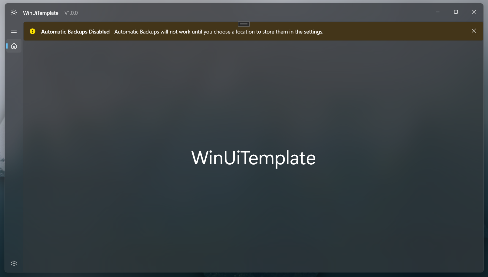

# WinUI3 MVVM Template

This project provides a Visual Studio template that can be used to kickstart a WinUI3 application with MVVM and Dependency Injection architecture. It provides many useful built in services and stores, which will be useful in a large variety of applications.

## Status

 

## Contents

- [Status](#status)
- [Contents](#contents)
- [Available Services](#available-services)
- [Solution Structure](#solution-structure)
- [How To Use](#how-to-use)
- [UI Components](#ui-components)
  - [Pages And Views](#pages-and-views)
  - [Custom Controls](#custom-controls)
- [Extensibility](#extensibility)
  - [Adding A Service Or Store](#adding-a-service-or-store)
  - [Adding A Page](#adding-a-page)
- [Code Style](#code-style)
- [Contributing](#contributing)
- [License](#license)
- [AI Usage](#ai-usage)


## Available Services

To see the public properties, functions and events that are available for you to use for any service/store, read its interface file and the docstrings in it. Adding descriptions for every function in this README runs the risk of them becoming outdated.

### TLDRs:

Services:
- [Archive Service](#archive-service)  
  Creates .zip files asynchronously
- [Backups Service](#backup-service)  
  Automatically backs up user data
- [Dialog Service](#dialog-service)  
  Shows dialogs, including file and folder pickers, to the user
- [Encryption Service](#encryption-service)  
Encrypt and decrypt data
- [FileUtils](#file-utils)  
  Read and write files and folders asynchronously
- [HttpService](#http-service)  
A base class to use with APIs, very untested
- [LoggerService](#logger-service)  
  Logs messages to both console and file
- [NavigationService](#navigation-service)  
  Sets the current page
- [NotificationService](#notification-service)  
  Displays notifications above the current page, supports an embedded button
- [SearchService](#search-service)  
  Search a list of objects for a search term
- [ThemeService](#theme-service)  
  Handles changing theme, along with `MainWindow.xaml.cs`

Stores:
- [FilePaths](#file-paths-store)  
  Stores paths of files and folders used by the application
- [ImageCache](#image-cache)  
  Caches local and online images the first time it sees them. Supports encryption
- [ObjectCache](#object-cache)  
  Wrapper around a Dictionary with useful functions. Use as a base class
- [LocalObjectRepository](#local-object-repository)  
  Generates a local SQLite database for (almost) any object. Use as a base class
- [RemoteObjectRepository](#remote-object-repository)  
  Connects to a remote SQL database, only tested with PostgreSQL. Use as base class
- [ProgramData](#program-data)  
  Stores various bits of data about your application.
- [UserSettings](#user-settings)  
  Allows the user to configure the application's behaviour.

### Archive Service

This service is used for generating .zip files asynchronously, with support for `CancellationToken`s. Its main purpose is to be used by other services like the `BackupService` but can also invoke it maanually if your application needs to generate archives.

### Backup Service

This service automates the process of backing up the user's data to a location of their choosing. Backups are performed by compressing all content from `IFIlePaths.RootFolder` into a zip file. Automatic backups can be disabled by you with `IProgramData.EnableBackups` or by the user with `IUserSettings.AutomaticBackups`. A backup is performed every time the user closes the application.

The user can then restore their data from one of these zip files from the `BackupsPage`. A backup is performed before restoring, if it succeeds, then everything in `IFilePaths.RootFolder` is deleted, and the backup archive is extracted into the root folder, then the application restarts to load the data.

The `Windows.Storage` APIs require the user to browse to a location in a folder picker dialog for your application to gain access that folder. Because of this, when a user first opens your application, they will see a Warning Notification stating that automatic backups cannot be performed until they've picked a location to store them, unless you or the user has disabled backups.



### Dialog Service

This service is used for showing pop-up dialogs to the user, as well as handling file and folder picker dialogs. It can display messages, ask for confirmation or display a custom `ContentDialog`. The interface for this service is defined in `WinUiTemplate.Core`, but its implementation is in the main `WinUiTemplate` project as it relies on UI-level code. For good UX, use [NotificationService](#notification-service) instead of `ShowMessage` unless the user has to acknowledge the message before continuing.

### Encryption Service

> [!WARNING]
> The code in `EncryptionService.cs` has mostly been AI generated. It has been thoroughly reviewed and tested. Encryption is not my speciality, so I cannot be certain on the security of it.
>
> Data stored with either ObjectRepository store is not yet encrypted, unless you manually encrypt it before storing it.

This service can be used to encrypt or decrypt text. Its main purpose is to be used by other services, depending on the level of `IProgramData.EncryptionLevel`, but you can invoke it manualy too.

### File Utils

This service is a wrapper around the `Windows.Storage` API that simplifies interacting with files and folders. Every operation is asynchronous and supports cancellation tokens if you're doing something like scanning folder recursively and you want the user to be able to abort the operation at some point. Each function returns a record that stores the result, any `StorageFile` or `StorageFolder` instances retrieved by the function, and an error message if not successful. Each record has an `implicit operator bool` that points to the `Success` property.

Example use:

```csharp
IFileUtils fileUtils = serviceProvider.GetRequiredService<IFileUtils>();

FileReadResult result = await fileUtils.TryReadFileAsync("C:\Example.txt");
if (!result) {
    logger.LogError(result.ErrorMessage);
    return;
}

DoSomethingWithFileContent(result.Content);
```

### Http Service

This service is meant to serve as a base class for a service that communicates with an API, but it has not yet been tested. This service will be updated once I use it in an actual application. If you use and update it in an application, please consider contributing your chages to this template. I envision it working something like this:

```csharp

public interface IWeatherService : IHttpService {...} // Or add IHttpService to the inheritance list below
public class WeatherService : HttpService, IWeatherService 
{
    public WeatherService(IServiceProvider serviceProvider) : base(serviceProvider, baseUrl: "https://exampleweatherapi.com/api/v1/")

    public record WeatherInfo(int Temperature, int WindSpeed);

    public WeatherInfo GetWeatherReport(CancellationToken token = default){
        return GetAsync<WeatherInfo>("weather", token)
    }
}
```

### Logger Service

A service for thread-safe logging to the console for development and to a file for debugging user issues. Applications created with this template will have their 'Application > Output type' property set to 'Console Application' to help you see live-logging as you develop. Don't forget to change this to 'Windows Application' before releasing your application.

### Navigation Service

This is service is used by the `NavigationView` in `MainPage.xaml` / `MainPageViewModel.cs` to set the current page, but you can also use it to navigate pages from any part of your UI / VM layers. Use `INavigationService.AllowNavigation` to enable/disable the `NavigationView`.

### Notification Service

Display notification banners above the current page. See [BackupService](#backup-service) for an example of a warning service. You can also pass in `string buttonText, Action onClick` to have a button displayed in the notification that invokes `onClick`. You can control whether this button also dismisses the notification with the argument `closeOnButtonClick` which defaults to `true`. For good UX, use this instead of [DialogService](#dialog-service) unless the user has to acknowledge the message before continuing.

### Search Service

This service can help you filter an `IEnumerable<T>` using a search term and an array of properties to check against that search term. The user can control this service's behaviour using `IUserSettings.SearchCaseSensative` and `IUserSettings.SearchSplitQuery`, which splits a query like `"example query"` into the tokens `["example", "query"]`. Then, each object's selectors must contain each of those tokens to be included in the results.

Example use:

This is loosely based on code in my [Factory Planner](https://github.com/CubeSuite/FactoryPlanner) application, see that repo for how I actually use this service.

```csharp
public class Recipe(){
    public string Name;
    public Dictionary<string, int> Ingredients;
    public Dictionary<string, int> Outputs;

    // Not needed, but cleans up calls to searchService
    public static Func<Recipe, object?>[] GetSearchSelectors() => [
        recipe => recipe.Name,
        recipe => recipe.Outputs.Keys.Select(item => item.Name)
    ]
}

List<Recipe> AllRecipes;
List<Recipe> FilteredRecipes;

private void OnSearchTermChanged() {
    IEnumerable<Recipe> results = await searchService.Search(AllRecipes, SearchTerm, Recipe.GetSearchSelectors());
    FilteredRecipes = results.ToList();

    // Instead of GetSearchSelectors(), you can do this:  
    IEnumerable<Recipe> results = await searchService.Search(AllRecipes, SearchTerm, [
        recipe => recipe.Name,
        recipe => recipe.Outputs.Keys.Select(item => item.Name)
    ]);
}

private void OnRecipeAdded(Recipe recipe){
    if (await searchService.AppearsInSearch(recipe, SearchTerm, Recipe.GetSearchSelectors())) {
        AddRecipeToGUI(recipe);
    }
}
```

### Theme Service

This service is used to control the applications current theme. It handles some of the backend code of theme switching. It is used by `CustomTitleBarViewModel` to toggle the theme and is used as a bridge between `IUserSettings` and the code that actually does theme and colour switching in `MainWindow.xaml.cs`. You shouldnt' need to use this service manually.

### File Paths Store

This store contains all the paths of folders and files that are used by your application. Your application is automatically granted access to read and write files inside of `IFilePaths.RootFolder` so place any new files or folders within that one to avoid needing to get permission from the user through `IFileUtils.PickSingleFolder`.

> [!TIP]
> If you add a folder to this store, add it to `FileUtils.cs::CreateProgramFolderStructure()` to have your application create that folder on-launch if it doesn't exist.

> [!IMPORTANT]
> See [Configuring Your Application => The Root Folder](#the-root-folder) to make `RootFolder` easy to find. It's impossible if you don't.

### Image Cache

This store caches images from either:
- Local / Network paths - In case the user deletes the original.
- Online - To skip repeated downloads and speed up image rendering for common images.

When you pass a path to GetImage for the first time, the image is saved to the cache and returned as a BitmapImage. Subsequent calls with the same path return a new instance of `BitmapImage` generated from the cached file's path. `ImageCache` does not store the generated instances of `BitmapImage` in memory, only a `Dictionary<string, string>` that maps the given path to the cached path.

If the cache grows beyond a limit defined by `IUserSettings.ImageCacheWarnSizeGb` then the user will be shown a warning notification when they open your application, with a button to clear the cache. This button can also be found on the `SettingsPage` along with a toggle to disable image caching entirely.

If you set `IProgramData.EncryptionLevel` to `Data` then the cached images will be encrypted.

Example use:

```xml
<Image Source="{Binding UserChosenImage}" />
```

```csharp
[ObservableProperty] public partial BitmapImage? UserChosenImage { get; set; }

private async Task PickNewImage(){
  StorageFile? image = dialogService.PickSingleFile("*.png");
  if (image == null){
    UserChosenImage = null;
    return;
  }

  UserChosenImage = await imageCache.GetImage(result.Path);
}
```

### Object Cache

This store acts as a wrapper around a dictionary that handles key-checking and logging errors. Be wary of calls to this store slowing down as you add thousands of items to the cache. If you need to store thousands of objects, consider using one of the OjectRepository stores and using some logic to keep up to one thousand objects in the cache. When initialising this class, you need to provide `<T,V>` where `T` is the type of the key and `V` is the type of the object.

I recommend using this class as a base class and overloading the functions it provides to make calls to it easier:

```csharp
public class Item{
    int ID;
    string Name;
}

public interface IItemManager : IObjectCache<int, Item>{} // Or add IObjectCache<int, Item> to the inheritance list below
public class ItemManager : ObjectCache<int, Item>, IItemManager 
{
    public OperationResult TryAdd(Item item){
        TryAdd(item.id, item);
    }

    ...
}
```

### Local Object Repository

> [!WARNING]
> The code in `LocalObjectRepository.cs` has mostly been AI generated. It has been thoroughly reviewed and tested. See [AI Usage](#ai-usage) for more details.

This store is able to generate a table in a local SQLite database for any classes you need to store instances of. If the .db file does not already exist, a new one will be created. This store supports fields/columns for all basic types, as well as:
- `DateTime`
- `Guid`
- `Color`
- `Enum`
- `Collections` - See `IsCollectionType()` for supported collections.

To use this store, for performance reasons I highly recomended using an ObjectCache for your base class and encapsulating the LocalObjectRepository object. This makes interacting with the store fast and means you don't have to think about managing the database manually. When initialising this class, you need to provide `<T,V>` where `T` is the type of the key and `V` is the type of the object. A column in the table will be generated for each private field in the class, to avoid you needing to adjust the public interface of your models. If the key for a value is a field of that value, the first two columns will be duplicates, except values in the 'Key' column are converted to string. For example:

```csharp
class Item {
  private int _id;
  private string _name;
  private int _value;

  public string Price => $"£{_value}";
}

Item item = new Item(_id: 1, _name: "Test item", _value: 100);
IObjectRepository repo = new LocalObjectRepository<int, Item>(serviceProvider);
repo.TryAdd(item.ID, item);

```

Will generate the following table. Note that column names correspond to the private members, `Price` does not get a column:

|Key|_id|_name|_value|
|:-:|:-:|:---:|:----:|
|"1"|1|"Test item"|100|

Example use:

This is loosely based on code in my [Factory Planner](https://github.com/CubeSuite/FactoryPlanner/blob/main/FactoryPlanner.Core/Stores/ItemManager/ItemManager.cs) application, see that repo for how I actually use this store.

```csharp
public interface IItemManager : IObjectCache<int, Item> {...}
public class ItemManager : ObjectCache<int, Item>, IItemManager 
{
    private IObjectRepository<int, Item> database;

    public ItemManager(IServiceProvider serviceProvider){
        database = new LocalObjectRepository<int, Item>(serviceProvider);

        RefreshCache();
    }

    public OperationResult TryAdd(Item item){
        OperationResult result = database.TryAdd(item.ID, item);
        if (!result) return result;

        return base.TryAdd(item.ID, item); 
        // base. isn't needed here, but it makes it obvious you're
        // adding it to the dictionary in the base ObjectCache
    }

    ...

    private void RefreshCache(){
        base.Clear();
        foreach (Item item in database.GetAll()){
            base.TryAdd(item.ID, item);
        }
    }

    private void GetNewItemID(){
        return database.Count == 0 ? 0 : database.Keys.Max() + 1;
    }
}
```

### Remote Object Repository

> [!WARNING]
> The code in `RemoteObjectRepository.cs` has mostly been AI generated. It has been thoroughly reviewed and tested. See [AI Usage](#ai-usage) for more details.

This store operates in the same way as [Local Object Repository](#local-object-repository), but it connects to a remote SQL database instead. Details of that database should be specified in `IUserSettings`. It has only been tested with a PostgreSQL database so far. See the example above for usage.

### Program Data

This store contains a few properties that contain information about your application, and allows you to configure the behaviour of some services. You can use these options to do something like turning off automatic backups if your application doesn't require them. See [Configuring Your Application => Program Data](#program-data-1) for more info.

### User Settings

This store contains settings that the user can modify to tweak the behaviour of your application. User settings are handled across multiple files:

- `UserSettings.cs`
  - This file contains the fields that store the values of each setting and the properties to access them.
  - It also handles saving and loading to/from a json using `SettingsDTO`
  - At the top of this file, is a comment with instructions for adding a new setting.
- `SettingsPageViewModel.cs`
  - This file is where you configure the setting's entry in the UI, name, description, icon etc.
- `SettingsPage.xaml`
  - This is where the settings controls are rendered. If you need to add support for a new setting type:
    - a) You'll need to add some UI to the `SwitchPresenter` on this page.
    - b) Consider contributing that new setting type to this repo. 

## Solution Structure

The solution is broken into three parts:
- `WinUiTemplate` - Put all your UI-layer code in this project.
- `WinUiTemplate.Core` - Put all your ViewModel and Model layer code in this project.
- `WinUiTemplate.Tests` - Add any unit tests to this project.

When you generate a project with this template, 'WinUiTemplate' will be replaced with the value of `%safeprojectname%` in those parts.

## How To Use

### Installation

1) Head to the [releases](https://github.com/CubeSuite/WinUiTemplate/releases) page of this repo
2) Find the 'Assets' section of the latest release
3) Download `WinUi3-MVVM-Template.zip`
4) Store it in your configured templates location.
   1) For Visual Studio 2026, this defaults to:  
   `My Documents\Visual Studio 18\Templates\ProjectTemplates\C#`

> [!TIP]
> VS caches project templates, so when upgrading, consult Google / AI for steps to refresh the cache if you're generating a project and it's missing features you can see in the repo.

### Generating A Project

These instructions have been written using VS 2026 as a reference, but should be the same for other versions of VS.

1) Open Visual Studio
2) Click 'Create a new project'
3) Search for 'WinUI 3' or 'MVVM'
   1) I recommend pinning it if you tend to make many applications.
4) Select the template and click next
5) Name your project and click 'Create'

### Configuring Your Application

#### Program Data

In `ProgramData.cs` there are several ToDo comments for settings for you to configure.
- `ProgramName`  
This is the display name of the program. It is used in several UserSettings descriptions.
- `EnableBackups`  
This can be used to disable the automatic backups feature of this template. If you disable them, the 'Backups' category of settings in `SettingsPageViewModel` will be hidden from the user.
- `EncryptionLevel`
  - Set to `Settings` to only encrypt the values of `EncryptedSetting` in `Settings.json`.
  - Set to `Data` to encrypt everything in `IFilePaths.DataFolder` and images cached by `ImageCache`
  - See warning below
- `UsesApi`
  - Sets whether your application communicates with any online HTTP APIs. If `false`, the 'Internet' category of settings in `SettingsPageViewModel` will be hidden from the user.
- `UsesRemoteDatabase` 
  - Sets whether your applicate uses `RemoteObjectRepository` to communicate with a remote SQL database. If `false`, the 'Database' category of settings in `SettingsPageViewModel` will be hidden from the user.
  
  
> [!WARNING]
> Any data stored with either `ObjectRepository` store is currently not encrypted, even with `EncryptionLevel` set to `Data`, unless you manually use `EncryptionService` before passing it to the store.

#### The Root Folder

The first time you launch your application, Windows will create the folder that `IFilePaths.RootFolder` points to. Your application doesn't need to get permission from the user to read and write files in this folder. You need to give this folder a name though, or it will be assinged a UUID and be impossible to find. 

1) In the solution explorer, expand the main project.
2) Find the file 'Package.appxmanifest' and double click it.
3) Click the 'Packaging' tab.
4) Replace the UUID in 'Package name' with the name of your application.
5) Now when your program is run, it will generate the folder:  
   `%LocalAppData%/Packages/{Package name}_{Some random characters}/`
   1) `ProgramData.RootFolder` points to the 'LocalState' folder inside this one.
   2) `ProgramData.CacheFolder` points to the 'LocalCache' folder inside this one.
6) You can now ask your users to find the log file there if a bug is preventing them from using the button for opening `IFilePaths.LogsFolder` in File Explorer.

### Testing

The `WinUiTemplate.Tests` project contains unit tests for services and stores defined in the `WinUiTemplate.Core` project.

#### Running Tests Locally

The easiest method is to use Visual Studio's Test Explorer window, but if you want to run tests through the terminal:

From the repository root:

```powershell
dotnet restore
dotnet build --configuration Release /p:PublishReadyToRun=false
dotnet test --configuration Release --verbosity normal
```

If you want to exclude PostgreSQL-dependent tests:

```powershell
dotnet test --configuration Release --verbosity normal --filter "Category!=RequiresPostgreSQL"
```

#### GitHub Actions Workflow

> [!WARNING]
> This workflow is not included in the template, manually download a copy from this repo if you want it.

The workflow in `.github/workflows/run-unit-tests.yml` runs automatically on pull requests to `main`, and can also be triggered manually using `workflow_dispatch`.

The workflow does the following:
1) Checks out the repository
2) Sets up .NET 8
3) Restores dependencies
4) Builds in `Release` configuration
5) Runs tests with the filter `Category!=RequiresPostgreSQL`
6) Publishes `.trx` test results to the workflow summary

### Test Configuration

`RemoteObjectRepositoryTests.cs` requires access to a PostgreSQL database. Configure the connection details to your PostgreSQL instance through `WinUiTemplate.Tests/testconfig.json`.

#### Set Up PostgreSQL Test Config

1) Open the `WinUiTemplate.Tests` directory.
2) Copy `testconfig.example.json` to `testconfig.json`.
3) Update `testconfig.json` with your PostgreSQL details.

Example:

```json
{
  "PostgreSQL": {
    "Host": "1.2.3.4",
    "Port": 12345,
    "Database": "WinUI3Debug",
    "Username": "your_username",
    "Password": "your_password"
  }
}
```

#### Notes

- `testconfig.json` is ignored by git to avoid committing credentials.
- PostgreSQL tests create temporary databases named `<Database>_test_<guid>`.
- Temporary databases are cleaned up automatically after test execution.
- Your PostgreSQL user should have permissions to create and drop databases.

## UI Components

### Pages And Views

#### Main Page

This page houses the `CustomTitleBar` view, the `ItemsRepeater` used to display notifications, and a `NavigationView` that provides navigation and displays the currently selected page. You only need to modify this to [add new pages](#adding-a-page).

#### Home Page

The main page of your application, just a placeholder, replace it with your own Home Page.

#### Backups Page

This page is where the user can manage their automatic backups. For each backup in `IUserSettings.BackupsFolder`, they can either delete it or restore it. This page does not appear in the menu if there are no backups available, or if automatic backups have been disabled.


#### Settings Page

This is where the user can configure their settings. Settings are grouped into categories, some of which may be hidden depending on your configuration in `ProgramData.cs`. Settings are populated from `SettingsPageViewModel.SettingsCategories`.


> [!TIP]
> I recommend reading through `SettingsPageViewModel` to familiarise yourself with the different types of Setting that you can use.

#### CustomTitleBar

Modify this view to adjust the content in the title bar. By default, it contains a button to toggle between light and dark mode, a label displaying `IProgramData.ProgramName` and a label displaying the application's version. The current version is extracted from the Assembly, so update it there to update the label.

#### MessageView

This view is used by `IDialogService.ShowMessage()` to display pop-up messages of varying levels. Use it as a guide to create custom dialogs to show with `IDialogService`.

### Custom Controls

Currently the template only includes one custom control. It is a `TitleLabel` that looks like this:


Set the title through the `Text` property.

## Extensibility

### Adding A Service Or Store

I recommend keeping all services in the same namespace to avoid lots of using statements in files. To achieve that:

1) In the `.Core` project, right click the 'Services' or 'Stores' folder and add a new class.
2) Write your new service / store.
3) Place your cursor in the class name and press Ctrl+. and pick 'Extract interface'
4) Create the interface in a new file.
5) Add a folder to the 'Services' / 'Stores' folder with the same name as your new class.
6) Drag the class and interface files into the folder and decline adjusting namespaces.
7) Add `.Interfaces` to the namespace of the interface file.

Then to add the service to the service provider:

1) Go to 'App.xaml.cs'
2) Find `ConfigureServiceProvider()`
3) Add a line for your service/store.
4) Add to `InitialiseServices()` or `InitiliaseUiServices` if needed.

### Adding A Page

I recommend keeping all pages in the same namespace to avoid lots of using statements in files. To achieve that:

1) In the main project, right click 'MVVM/Pages' and click 'Add => New Item...'
2) Click the 'C# Items => WinUI' category
3) Select 'Page' and create a new one.
4) Right click 'MVVM/Pages' and create a new class called '{PageName}ViewModel.cs'
5) Design your new page and view model.
   1) Make sure your view model inherits from `ObservableObject`.
6) Create a folder for the page inside 'MVVM/Pages' and move the files into it and decline adjusting namespaces.

To add your page to the `NavigationView`:

1) In 'MainPage.xaml'
   1) Find the `NavigationView.MenuItems` tag, or `.FooterMenuItems` if your page belongs with the backups and settings pages.
   2) Create a new instance of `NavigationViewItem` and give set its `Content` and `Icon` property.
2) In 'MainPage.xaml.cs'
   1) In `OnNavigationRequested()` add a block for your new view model and page.
   2) In `OnNavigationViewItemInvoked()` add a `case` for your page name and view model.

> [!NOTE]
> The `Content` property of the `NavigationViewItem` must be unique.

> [!TIP]
> The 'Icon' property has limited options, if you can't find one you like, do this instead:
> ```xml
> <NavigationViewItem Content="My New Page">
>    <NavigationViewItem.Icon>
>        <FontIcon Glyph="&#xE8C6;">
>    <NavigationViewItem.Icon>
> </NavigationViewItem>
>
> Download the WinUI 3 Gallery app to browse Glyphs.
> ```

## Code Style

My personal code style mostly adheres to the C# standard with a few exceptions that you have likely noticed in this README. 

1) I use inline opening braces, a preference I gained from my time with Java / Android development.
2) In larger constructors, I use argument names.
3) For event listeners, I name them with the format `On{ControlName}{EventName}` instead of `{ControlName}_{EventName}`
4) Private fields only start with an underscore when they have a public property that points to them.

## Contributing

Please feel free to raise PRs to address issues with the project or to add new features to it. If you do, please adhere to the code style in the section above. Also, don't use `var`, can't stand it.

AI generated code is acceptable, but please review the code before raising the PR, don't just leave it to me. For any changes to the README, do not use AI. I find AI generated READMEs are very verbose and contain useless info, and this README is already large enough. 

## License

TLDR, it's GPL-3.0, so any project you make distribute using any code from this template also needs to use the same license and you need to declare that it is a modified version of this project. **Read the introduction part of the license before distributing your application.**

## AI Usage

AI was used for the following purposes in this project:

- As an alternative to documentation when I needed to learn something.
- To design the interfaces of the services and stores in this application.
- To write docstrings in the interfaces.
- To design the two GitHub Action workflows.
- `EncryptionService.cs` was generated by AI, then hand-written by me, so it has all been thoroughly reviewed and tested. That said, encryption is not my expertise, so this could do with manual review by someone with more knowledge on the subject than me.
- `LocalObjectRepository` and `RemoteObjectRepository` were AI generated and then reviewed and tested. By this point in development, I was eager to use the template to start working on another application, so I generated these Stores. Each has been review and tested.
- All unit tests except those in `BackupServiceTests` have been AI generated and have been briefly reviewed. I wrote the `BackupServiceTests` as a learning exercise, then let AI generate the rest to save time.

All other code in this template has been designed and written by me, with various snippets coming from online guides, examples and previous collaborative projects.